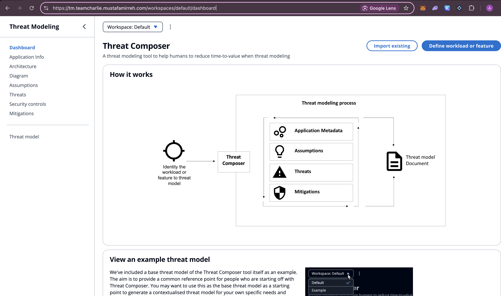

# Amazon Threat Model Application

## Overview
This project involves containerizing Amazon's threat model application using Docker, with optimizations achieved through multi-stage builds. The Docker image is then pushed to Amazon Elastic Container Registry (ECR). Infrastructure provisioning for deploying this application is managed with Terraform, creating an ECS task, service, and cluster A Virtual Private Cloud (VPC) and load balancer was implemented. The project includes automated pipelines, creating an end-to-end DevOps project.

Below is a working instance of the threat model tool:




## Features
- **Containerization:** Dockerized Amazon's threat model application for consistent and portable deployment.
- **Optimized Docker Builds:** Multi-stage builds to reduce image size and improve performance.
- **ECR Integration:** Push Docker images to Amazon ECR for easy deployment.
- **Infrastructure as Code (IaC):** Use of Terraform to provision ECS task, service, and cluster.
- **High Availability:** Implemented a load balancer and VPC for scalable and reliable application deployment.
- **Automated Pipelines:** End-to-end deployment pipelines for continuous integration and continuous deployment (CI/CD).

## Setup


### Local Application Setup

If you want to view the threat composer tool locally,folow the steps below

1. **Clone the repository:**
   ```bash
   git clone <ecs-project>
   ```
   This command will copy the project repository from the remote server (such as GitHub) to your local machine. Ensure you have the correct URL for the repository to get all the necessary files and code.

2. **Navigate to the project directory:**
   ```bash
   cd <app>
   ```
   After cloning the repository, move into the project directory where all the application files are located. This is essential for running further commands and setting up the application.

3. **Install dependencies using Yarn:**
   ```bash
   yarn install
   ```
   This command will install all the necessary dependencies listed in the project's `package.json` file. Yarn ensures that all required libraries and modules are set up correctly so the application can run without issues.

4. **Start the application locally:**
   ```bash
   yarn start
   ```
   Once the dependencies are installed, use this command to start the application on your local machine. This will launch the application, allowing you to test and interact with it in your local development environment.

### Local Docker Container Setup
1. **Build the Docker image:**
   ```bash
   docker build -t <image-name> .
   ```
   This command will create a Docker image of the application using the Dockerfile in the project directory. The `-t <image-name>` option tags the image with a specific name, which makes it easier to reference later.

2. **Run the Docker container:**
   ```bash
   docker run -d -p 3000:3000 --name <container-name> <image-name>
   ```
   This command will start a new container from the Docker image you just built. The `-d` flag runs the container in detached mode (in the background), and `-p 3000:3000` maps port 3000 of the container to port 3000 on your local machine. Replace `<container-name>` with a name for the container and `<image-name>` with the name you used when building the image.

3. **Stop the Docker container:**
   ```bash
   docker stop <container-name>
   ```
   Use this command to stop the running container when you no longer need the application running. Replace `<container-name>` with the name you assigned to the container when starting it.

## Project Breakdown

### Terraform Breakdown

The Terraform configuration for the Threat Composer application is organized into multiple modules, each responsible for deploying specific components of the AWS infrastructure. We chose this modular approach to maintain a clean, scalable, and reusable codebase. Below is a breakdown of how these modules are structured and why this method was chosen.

#### Root `main.tf`
The `main.tf` file in the root directory serves as the central control point for deploying the infrastructure. It pulls together the individual modules (ECS, ALB, VPC, and Route 53) to create a cohesive environment for the application. This file defines the overall configuration and specifies how these modules interact with each other.

The key benefits of this approach include:
- **Simplified Management:** By organizing the infrastructure into separate modules, each with a clear purpose, it becomes easier for us to manage and update specific parts of the infrastructure without affecting others.
- **Reusability:** Modules can be reused across different projects or environments. For instance, the VPC module can be utilized for other applications that require similar network configurations.
- **Scalability:** Each component can be scaled independently, offering greater flexibility as the project grows.

### Module Breakdown

#### 1. ECS Module
The **ECS (Elastic Container Service) module** is responsible for deploying the containerized application. It provisions the ECS cluster and creates the necessary task definitions and services to run the Docker containers.

**Key Components:**
- **ECS Cluster:** A scalable cluster that hosts the Docker containers.
- **Task Definitions & Services:** Define how the containers are deployed, including settings like CPU and memory allocation, networking, and scaling policies.

#### 2. ALB Module
The **ALB (Application Load Balancer) module** sets up an ALB that routes incoming traffic to the appropriate ECS services. This module handles the creation of target groups, listener rules, and health checks to ensure reliable routing.

**Key Components:**
- **Load Balancer:** Distributes incoming traffic across multiple containers to ensure high availability.
- **Target Groups & Health Checks:** Manage how traffic is routed and monitored across containers, ensuring that only healthy containers receive traffic.

#### 3. VPC Module
The **VPC (Virtual Private Cloud) module** provisions a dedicated network environment for the application, including subnets, route tables, and security groups. It ensures that all the components are deployed in a secure and isolated network.

**Key Components:**
- **Subnets (Public & Private):** Separates network resources based on accessibility requirements. Public subnets are used for load balancers, while private subnets host ECS containers.
- **Security Groups:** Control inbound and outbound traffic to ensure secure communication.
- **Route Tables:** Manage routing between different subnets and internet gateways.

#### 4. Route 53 Module
The **Route 53 module** handles DNS management and domain routing, ensuring that the application is accessible via a friendly domain name. It integrates with AWS ACM (Certificate Manager) for SSL certificate management, enabling secure HTTPS communication.

**Key Components:**
- **Hosted Zones & DNS Records:** Manage domain routing, ensuring that users can reach the application through a custom domain.
- **SSL Certificates (via ACM):** Enable encrypted communication, enhancing security for users.

### Dockerfile Breakdown

The Dockerfile now consists of two distinct stages labeled **"build"** and **"production"**. Below is a detailed examination of each stage:

#### Stage 1: Build
For the initial stage, we use `node:18-alpine` as the base image, which is known for its minimal footprint compared to the standard Node.js images. The operations performed in this stage include:

1. **Setting Up the Working Directory:** 
   - We establish `/app` as the working directory.

2. **Copying Necessary Files:** 
   - Key files such as `package.json` and `yarn.lock` are transferred into the image.

3. **Installing Dependencies:** 
   - We execute `yarn install` with an extended network timeout to ensure all dependencies are thoroughly fetched and installed.

4. **Copying Application Files:** 
   - All necessary application files are copied into the Docker image.

This stage focuses on assembling the application in a controlled, Docker-contained environment. It ensures that only essential dependencies and build tools are included in the final production image.

#### Stage 2: Production
The second stage also starts with the `node:18-alpine` base image. This part of the process is streamlined to include only what is necessary for running the application in a production environment:

1. **Preparing the Application:** 
   - The entire application directory from the build stage is copied over to the new stage. This method ensures that the production image contains only the compiled application and its runtime dependencies, excluding any build-specific tools and intermediate files.

2. **Exposing the Port:** 
   - The Dockerfile specifies port `3000` for the application, making it accessible on this port.

3. **Starting the Application:** 
   - The final command in the Dockerfile is set to run the application using `yarn start`.

### Importance of Multi-Stage Builds
Multi-stage builds provide significant advantages:

1. **Efficiency in Image Size:** 
   - By separating the build environment from the production environment, we significantly reduce the final image size, which speeds up the deployment process and minimizes runtime resource utilization.

2. **Security:** 
   - Smaller images generally contain fewer components, which can reduce the attack surface of the container.

3. **Cost-Effective:** 
   - Smaller images mean less storage and bandwidth consumption, translating to cost savings, especially in scaled environments.

 

## CICD Pipelines

### Docker.Yaml

The `docker.yaml` pipeline is explained below, it is the pipeline we have that is responsible for building the docker image and uploading it to Amazon ECR, it is defined so that the build and push only triggers when a change has been made to the application code

- **Checkout Code:** 
  - Pulls the latest code from the repository.
- **Log in to Amazon ECR:** 
  - Authenticates Docker with ECR, allowing it to push images to your ECR repository.
- **Build and Push Docker Image:**
  - Builds the Docker image from the Dockerfile in the app directory.
  - Pushes the tagged image to the specified ECR repository.

### Terraform YAML files

The terraform pipelines we have, are responsible for terraform plan, apply and destroy. They are triggered only when a change has been made to the tf config

- The **terraform plan pipeline** is set which means it runs on a push from any branch. The terraform apply and destroy pipelines can only be triggered manually using `workflow-dispatch` on the main branch (Once a PR has been completed). 

- **Checkout Code:** 
  - Retrieves the latest repository files.
- **Setup Terraform:** 
  - Installs and sets up Terraform in the workflow environment.
- **Terraform Init:** 
  - Initializes the Terraform configuration and downloads provider plugins.
- **Terraform Plan:** 
  - Creates an execution plan, displaying the resources Terraform will create or modify.
- **Terraform Apply:** 
  - Applies the configuration to provision the infrastructure if triggered manually.
- **Terraform Destroy:** 
  - Applies the destroy to the infrastructure if triggered manually within the main branch.


## Architecture Diagram


### Workflow Summary

#### User Access
- A user initiates a request, which is routed through the Internet Gateway (IGW) to the Application Load Balancer (ALB) in AWS.

#### Traffic Management
- The ALB forwards the request to an ECS task (a Docker container running the application) in a secure, private subnet.

#### Application Processing
- The ECS task processes the request, executes the application logic, and sends a response back via the ALB.

#### Response to User
- The ALB returns the response through the Internet Gateway to the user’s browser.

#### Automated Deployment Pipeline
- **GitHub Actions:** Builds and pushes Docker images to Amazon ECR.
- **ECS:** Pulls the latest image from ECR and deploys it using Fargate.
- **Terraform:** Manages the infrastructure (VPC, ALB, ECS, ECR) for consistency and automation.
